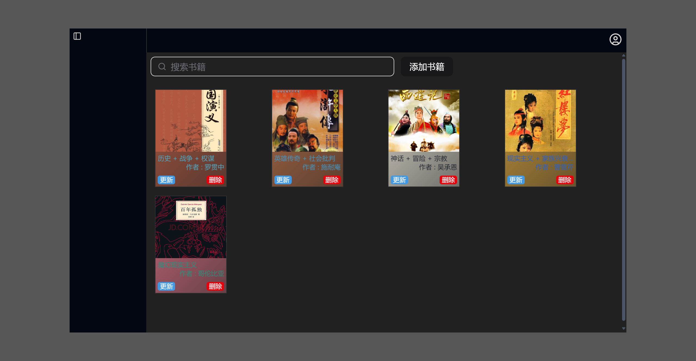
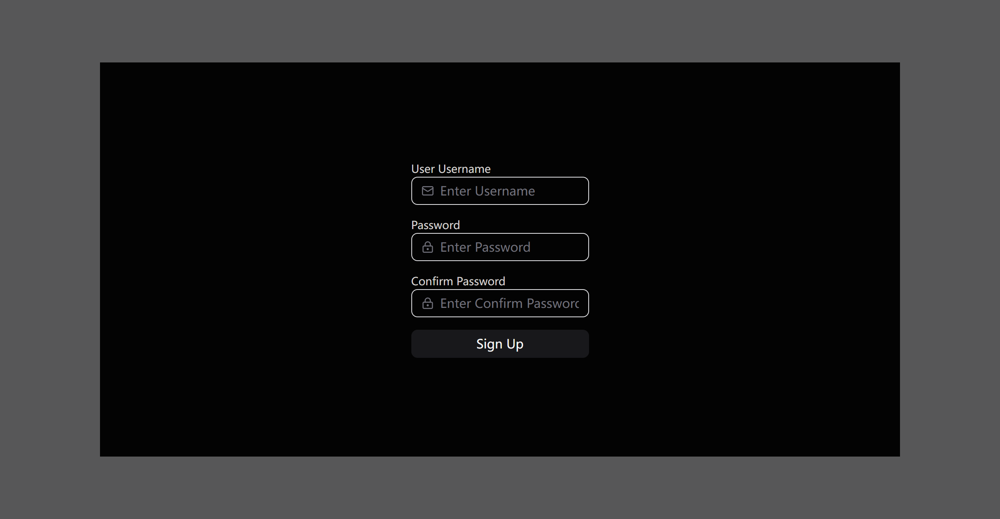

# Tiny Book Manager 📚

一个精致、轻量级的全栈图书管理系统。

## 📸 项目预览

<div align="center">
  
  <br/><br/>
  <div style="display: flex; justify-content: center; gap: 20px;">
    
    
  </div>
</div>

## ✨ 核心特性

- **极简交互**：采用现代化的 UI 设计，提供流畅的动画过渡与用户体验。
- **全栈架构**：
  - **前端**：React 19 + Vite + TailwindCSS v4 + Shadcn/ui，极致性能与开发体验。
  - **后端**：NestJS + TypeScript，稳健的企业级服务端框架。
- **图书管理**：支持图书的增删改查（CRUD），封面上传与预览。
- **用户系统**：完整的登录注册流程，支持表单验证与状态反馈。
- **文件存储**：内置本地文件存储方案（Multer），支持图片上传与管理。

## 🛠️ 技术栈

### Frontend

- **Framework**: React 19
- **Build Tool**: Vite
- **Styling**: TailwindCSS v4
- **Components**: Shadcn/ui + Radix UI
- **State/Query**: TanStack Query (React Query)
- **Form**: React Hook Form + Zod

### Backend

- **Framework**: NestJS
- **Language**: TypeScript
- **File Upload**: Multer
- **Validation**: Class Validator

## 🚀 快速开始

### 1. 克隆项目

```bash
git clone https://github.com/your-username/tiny-book-manager.git
```

### 2. 启动后端

```bash
cd backend
npm install
npm run start:dev
```

后端服务将运行在 `http://localhost:3000`

### 3. 启动前端

```bash
cd frontend
npm install
npm run dev
```

访问 `http://localhost:5173` 即可体验。

## 📂 目录结构

```
tiny-book-manager/
├── backend/          # NestJS 服务端代码
│   ├── src/
│   │   ├── book/     # 图书模块
│   │   ├── user/     # 用户模块
│   │   └── db/       # 数据存储逻辑
├── frontend/         # React 前端代码
│   ├── src/
│   │   ├── views/    # 页面视图 (Login, BookManage)
│   │   ├── components/ # 公共组件
│   │   └── apis/     # 接口请求
└── imgs/             # 项目截图
```
